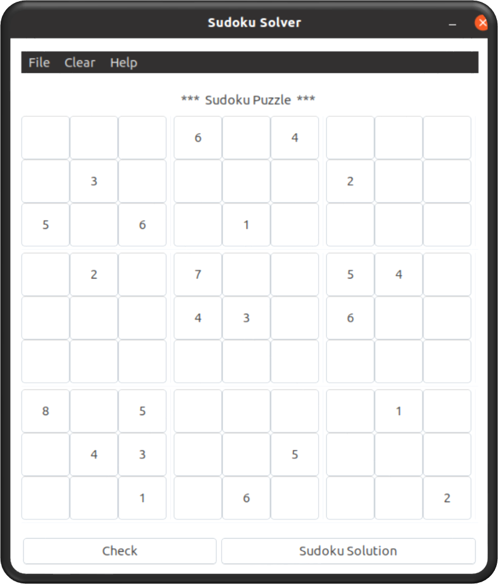
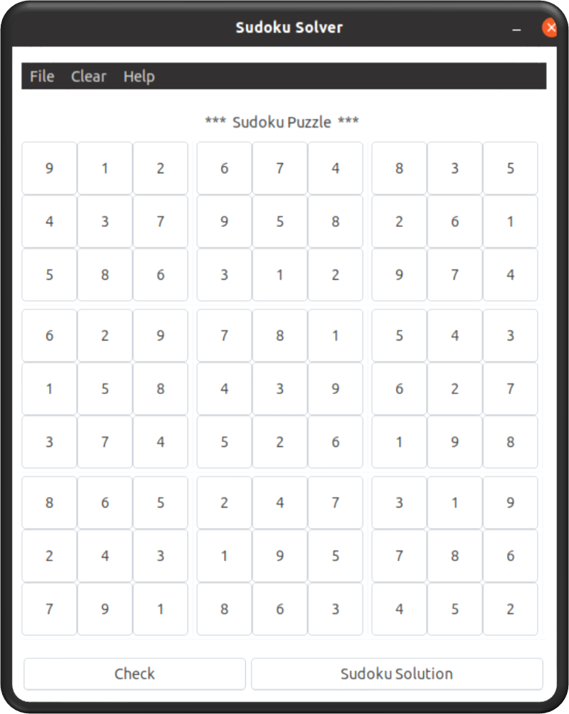

# Sudoku Solver

<div align=center>
<a href="http://www.open-std.org/jtc1/sc22/wg14/">
    
</a>

<a href="https://github.com/gtk">
    
</a>

<a href="https://github.com/GNOME/gtk">
    
</a>

<a href="https://github.com/SayanSahu99/EarBeats/blob/main/LICENSE">
    
</a>
</div>

Graphical Sudoku Solver application developed using C, GTK and glade. The solver uses the backtracking algorithm to solve the Sudokus. See attached PDF for more information.

<p align="center">
  
  
</p>

## Tools Used

 - C
 - GTK-3.0
 - Glade 

## Features

 - Solve a Sudoku puzzle
 - Show the results in the window
 - Allow the player to solve the sudoku and check
 - Read a Sudoku puzzle from a text file


## To Start Project

All of the libraries required to run GTK+ 3 applications are installed by default on modern Linux distributions, but to develop GKT+ 3 applications some additional files must be installed. Use the following command to install the required development packages. 

```sh
sudo apt-get install libgtk-3-dev
```
Glade can be installed with
```sh
sudo apt-get install glade
```

Clone this repository.
```sh
git clone https://github.com/SayanSahu99/sudoku-solver-gtk.git
```

Change the current directory
```sh
cd sudoku-solver-gtk
```

Build
```sh
make
```

Run the application
```sh
./sudoku
```

## License
Released under the [MIT](https://opensource.org/licenses/mit-license.php) license.